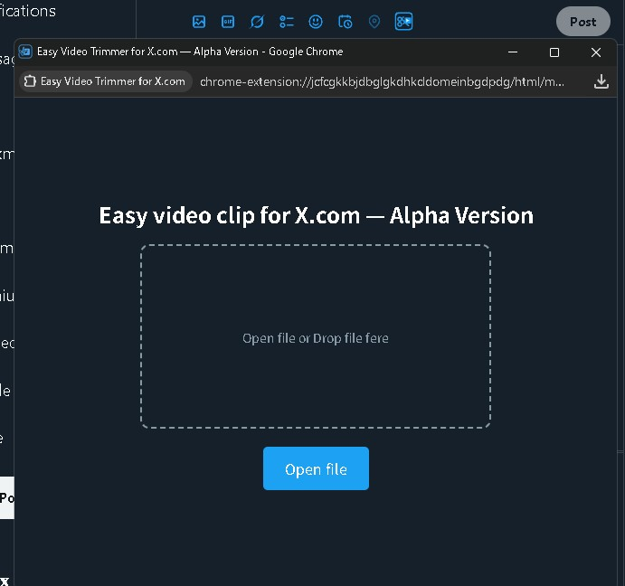

# Easy Video Trimmer for X.com

[日本人向けREADME](README_JP.md)

Easy Video Trimmer for X.com is a Chrome extension aimed at bringing back the simple video trimming experience previously available on Twitter's official site.  
All video editing and re-encoding happens entirely offline within your browser, ensuring your video files never leave your device. This guarantees strong security and complete privacy.  
No longer do you have to open external video editing software every time; you can easily trim and post gameplay highlights or other videos directly within X.com's posting interface.

## version

1.0.0-alpha.1

### Why Alpha Version?

This extension relies entirely on ffmpeg.wasm for video processing, which is currently subject to performance and technical limitations imposed by browsers (WebAssembly and Chromium).  
Therefore, we consider it an **Alpha Version (experimental)** until the following major issues are resolved:

- https://github.com/NPJigaK/easy-video-trimmer-for-x/issues/5
  - Due to technical constraints in WebAssembly, ffmpeg.wasm cannot utilize GPU hardware encoding, resulting in speeds **about 1/10 that of native (installed) software**. Processing times for long or high-quality videos can become extremely long.

- https://github.com/NPJigaK/easy-video-trimmer-for-x/issues/6
  - Chromium-based browsers currently limit stable parallel processing (thread count) of ffmpeg.wasm to a maximum of **4 threads**. Specifying 5 or more threads causes processing to hang. We're waiting for fixes from Chromium / ffmpeg.wasm developers.

- https://github.com/NPJigaK/easy-video-trimmer-for-x/issues/7
  - Currently, videos cannot be automatically attached to the X.com posting form. Due to Chromium's security restrictions, browser extensions (content scripts) have limited access to webpage DOM. Additionally, X.com's strict security policy (CSP) restricts this further. We are researching possible solutions for automatic attachment.

## 🛠️ Installation

### Chrome Web Store

_(Coming soon; manual installation currently required)_

### Manual Installation Steps

1. Download or clone and extract this repository.
2. Open **chrome://extensions/** in Chrome and enable **Developer mode**.
3. Click **Load unpacked** and select the extracted **easy-video-trimmer-for-x** folder (the directory containing manifest.json).

## 🚀 Usage

### 1. Open the X.com post creation screen.

### 2. Click the newly added **scissors icon**.

### 3. Drag & drop or select the video file on the displayed screen.

#### 3‑1. Select approximate timing using the white seek bar on the video.

#### 3‑2. Drag the yellow handles to precisely adjust the **start** and **end** positions for trimming.

#### 3‑3. Click the **Clip video download** button.

### 4. When the progress bar reaches 100%, the trimmed video is downloaded automatically.

### 5. Attach the downloaded video to your X.com post.

---

## ⚙️ Video Specifications

In compliance with [official best practices](https://developer.x.com/ja/docs/media/upload-media/uploading-media/media-best-practices):

| Item            | Specification                |
|-----------------|------------------------------|
| Minimum length  | 5 seconds                    |
| Maximum length  | 139 seconds                  |
| Video codec     | H.264 (`libx264`, High @ 4.1)|
| Audio codec     | AAC 128 kbps                 |
| Resolution      | Up to 720p                   |
| Thread count    | 4 (WASM)                     |

---

## Contributing

Easy Video Trimmer for X.com is a community-driven project. Bug reports, fixes, feature suggestions, and documentation improvements from anyone are welcome.  
If you are new to development, please feel free to report any issues or areas for improvement.

You can submit your suggestions through Issues or directly create Pull Requests. Even draft-level contributions are welcome.  
Detailed contribution guidelines are currently being prepared, but any proposals that maintain ease-of-use and backward compatibility are highly encouraged.

We look forward to your help in improving features and enhancing quality together.

## 📝 License

Please see [`LICENSE`](LICENSE) for details.

> **Disclaimer:** This extension is an independent open-source project and is not affiliated with X Holdings Corp. in any way.
