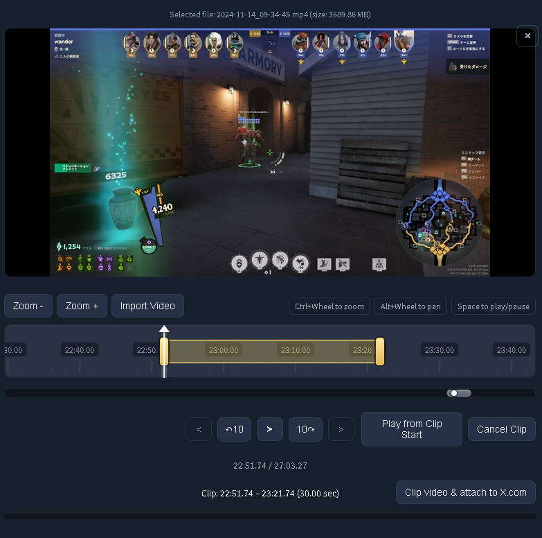

# Easy Video Trimmer for X.com

`Easy Video Trimmer for X.com` は、Twitter 時代に存在した「ブラウザ上で動画をトリミングして、そのまま投稿画面に添付できる神機能」を再現した Chrome 拡張機能です。

## 特徴

- X の投稿画面にハサミボタンを追加。専用のトリミング画面で切り出し、同じ投稿画面にそのまま MP4 を添付できます。加工した動画を一度ダウンロードする必要がないため、PC 上に不要なファイルが増えません。
- 有名な編集ソフトのようなタイムラインのドラッグハンドル、ズーム/パン、ホバープレビュー、キーボード操作に対応しており、直感的に微調整できます。
- ローカルで完結するプライバシー重視の設計。動画の加工に伴うネットワーク接続は発生しません。

## version

1.1.0-beta.2

### なぜ「beta」なのか？

- [#6](https://github.com/NPJigaK/easy-video-trimmer-for-x/issues/6): ffmpeg.wasm の並列処理（スレッド）は Chromium で **4 スレッドが上限**。5 以上にするとハングするため、フォールバックエンコードは 4 スレッド固定。
- それ以外の大きな課題（GPU なしエンコード、投稿フォーム自動添付）は WebCodecs 対応 ([#10](https://github.com/NPJigaK/easy-video-trimmer-for-x/pull/10)) とページ側添付 ([#11](https://github.com/NPJigaK/easy-video-trimmer-for-x/pull/11)) で解消済み。

## 🛠️ インストール方法

### Chrome ウェブストア

https://chromewebstore.google.com/detail/edpmkohefhijpaoolhkfmlbnbepikmbo?utm_source=item-share-cb

### 手動インストール手順

1. このリポジトリをダウンロード（またはクローン）して解凍します。
2. Chrome で `chrome://extensions/` を開き、**デベロッパーモード**を有効にします。
3. **パッケージ化されていない拡張機能を読み込む**をクリックし、解凍した `easy-video-trimmer-for-x` フォルダ（manifest.json があるディレクトリ）を選択します。

## 🚀 使い方

1. X の投稿画面を開きます。
2. 追加されたハサミアイコンをクリックします。  
   
3. ポップアップで動画をドラッグ＆ドロップするか、ファイル選択します。  
   
4. 黄色ハンドルで開始/終了位置を指定し、**Clip video & attach to X.com** を押すとトリミングとエンコードが実行されます。  
   
5. エンコード終了後、作成された MP4 が X.com の投稿フォームへ自動添付されます。自動添付に失敗した場合のみ、MP4 をダウンロードします。

## ⚙️ 動画の仕様

[公式のベストプラクティス](https://developer.x.com/ja/docs/media/upload-media/uploading-media/media-best-practices)に準拠。動画エンコードは WebCodecs（ハードウェア H.264 / GPU）を優先し、WebCodecs が使えない場合は ffmpeg.wasm（ソフトウェア H.264 / CPU）によるエンコードに切り替えます。トリミング / 音声処理 / MP4 mux は ffmpeg.wasm が担当します。

| 項目                            | X.com 推奨値                                           | 本拡張の出力（WebCodecs / ffmpeg.wasm）                                                                        | 合致状況   |
| ------------------------------- | ------------------------------------------------------ | -------------------------------------------------------------------------------------------------------------- | ---------- |
| 動画コーデック                  | H.264 High profile                                     | H.264 High@L4.1                                                                                                | OK         |
| 動画ビットレート                | 5,000kbps 以上                                         | 5,000kbps CBR                                                                                                  | OK         |
| フレームレート                  | 30 または 60FPS、60FPS 以下                            | ソース fps のまま（上限なし）                                                                                  | 要上限     |
| 解像度                          | 1280x720 / 720x1280 / 720x720（許容 32x32〜1280x1024） | WebCodecs: 縦横 720p 以内で元動画のアスペクト維持・アップスケールなし ffmpeg.wasm: 常に 1280x720 にスケール | 部分一致   |
| アスペクト比                    | 推奨 16:9 または 1:1（許容 1:3〜3:1）                  | WebCodecs: 元動画のアスペクト維持 ffmpeg.wasm: 実質 16:9 固定                                               | 部分一致   |
| ピクセルフォーマット / スキャン | YUV 4:2:0、プログレッシブ、PAR 1:1                     | 4:2:0 プログレッシブ                                                                                           | OK         |
| Open GOP                        | 含めない                                               | クローズド GOP                                                                                                 | OK         |
| 音声コーデック / プロファイル   | AAC LC、モノ/ステレオ                                  | AAC-LC ステレオ                                                                                                | OK         |
| 音声ビットレート                | 128kbps 以上                                           | 128kbps                                                                                                        | OK         |
| 再生時間                        | 0.5〜140 秒                                            | UI で 1〜139 秒を強制                                                                                          | OK         |
| ファイルサイズ                  | 512MB 以下                                             | 明示チェックなし（5Mbps + 128kbps で 139 秒 ≈ 87MB）                                                           | 未チェック |

## 貢献

`Easy Video Trimmer for X.com` はコミュニティ主導のプロジェクトです。バグ報告・修正・機能提案・ドキュメント改善など、どなたでも歓迎です。  
開発が初めての方も、気軽に Issue / Pull Request を送ってください（Draft でも構いません）。  
細かなガイドラインは整備中ですが、一緒に機能改善と品質向上を進めていければ嬉しいです。

## 📝 ライセンス

詳しくは [`LICENSE`](LICENSE) を参照してください。

> **免責事項**：本拡張機能は独立したオープンソースプロジェクトであり、X Holdings Corp. とは一切関係ありません。
