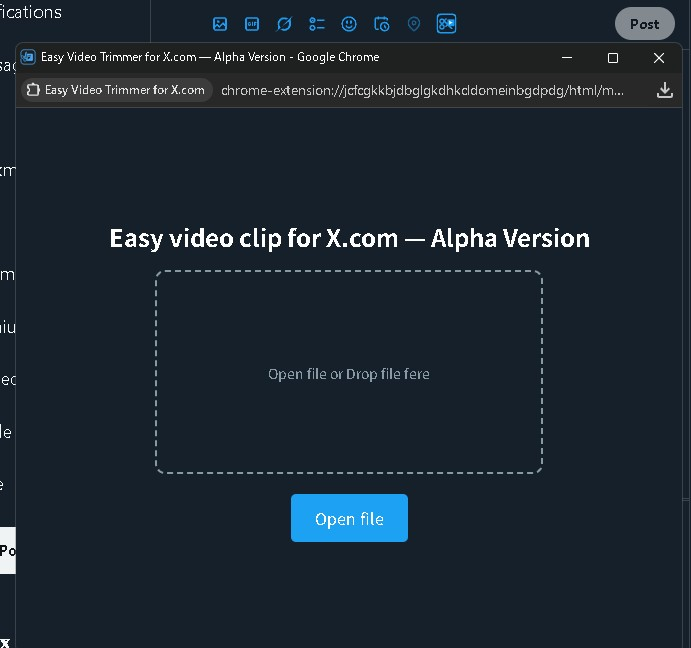

# Easy Video Trimmer for X.com

Easy Video Trimmer for X.com は、かつて Twitter 公式サイトに備わっていたシンプルな動画トリミング機能を再現することを目標とした Chrome 拡張機能です。  
動画の編集と再エンコードはすべてオフラインのブラウザ内で行われるため、動画ファイルが外部のサーバーへ送信されることは一切ありません。これにより高いセキュリティ性と完全なプライバシーが確保されます。  
毎回編集ソフトを立ち上げる手間からも解放され、X.com の投稿画面上で直感的に操作できるため、ゲームプレイの名場面などをすぐにクリップして投稿することが可能になります。

## version

1.0.0-alpha.1

### なぜ Alpha Version なのか？

この拡張機能は、動画のエンコード（処理）に使用している ffmpeg.wasm の性能およびブラウザの仕様制限（WebAssembly や Chromium の技術的な制約）に完全に依存しています。
そのため、以下の課題が解決されるまでは **Alpha Version（試験的なバージョン）** としています。

- https://github.com/NPJigaK/easy-video-trimmer-for-x/issues/5
  - ffmpeg.wasm は WebAssembly の技術的な制限で、GPU ハードウェアエンコードが使えず **ネイティブ版(PC にインストールするタイプ)の約 1/10 の速度** しか出ません。特に長い動画や高画質な動画では待ち時間が非常に長くなる可能性があります。
- https://github.com/NPJigaK/easy-video-trimmer-for-x/issues/6
  - Chromium 系ブラウザの仕様上、ffmpeg.wasm が安定して扱える 並列処理（スレッド数）が **最大 4 つ**までに制限されています。5 つ以上を指定すると処理が停止するため、現在は並列処理数を 4 つに制限しています。Chromium / ffmpeg.wasm 側の修正を待っています。
- https://github.com/NPJigaK/easy-video-trimmer-for-x/issues/7
  - 現在の仕様では、生成した動画を自動で投稿フォームに添付できません。Chromium の仕様により、拡張機能（コンテントスクリプト）はウェブページ（X.com）の DOM に制限されたアクセスしかできません。また、X.com の厳格なセキュリティポリシー（CSP）もあります。現在、添付自動化の実現方法を調査中です。

## 🛠️ インストール方法

### Chrome ウェブストア

_(近日公開予定、現在は手動インストールが必要です)_

### 手動インストール手順

1. このリポジトリをダウンロードまたはクローンして解凍します。
2. Chrome で **chrome://extensions/** を開き、**デベロッパーモード**を有効にします。
3. **パッケージ化されていない拡張機能を読み込む**をクリックし、解凍した **easy-video-trimmer-for-x** フォルダ (manifest.json があるディレクトリ) を選択します。

## 🚀 使い方

### 1. X の投稿画面を開きます。

### 2. 新しく表示された **ハサミアイコン** をクリックします。

### 3. 表示された画面で、動画をドラッグ＆ドロップまたはファイル選択。

#### 3‑1. video の白いシークバーで大まかな時間を選択

#### 3‑2. 黄色いハンドルをドラッグして切り抜く **開始位置** と **終了位置** を調整。

#### 3‑3. **Clip video download** ボタンをクリック。

### 4. 進捗バーが 100％ になったら、自動的にトリミングされた動画がダウンロードされます。

### 5. ダウンロードした動画を X に添付して投稿します。

---

## ⚙️ 動画の仕様

[公式のベストプラクティス](https://developer.x.com/ja/docs/media/upload-media/uploading-media/media-best-practices)に準拠

| 項目           | 内容                          |
| -------------- | ----------------------------- |
| 最小動画長     | 5 秒                          |
| 最大動画長     | 139 秒                        |
| 動画コーデック | H.264 (`libx264`, High @ 4.1) |
| 音声コーデック | AAC 128 kbps                  |
| 解像度         | 最大 720p                     |
| 使用スレッド数 | 4（WASM）                     |

---

## 貢献
Easy Video Trimmer for X.com はコミュニティ主導のプロジェクトです。バグの報告や修正、新しい機能の提案、ドキュメントの改善など、どなたでも気軽にご参加いただけます。  
開発が初めてという方も、気になった部分や改善点があればぜひ教えてください。   
Issue でご意見やご提案をお寄せいただくか、直接 Pull Request を送っていただくことも歓迎しています。途中段階の修正（Draft）でも遠慮なくお送りください。  
細かなルールなどは整備中ですが、使いやすさや安定性(後方互換性)を壊さない提案であれば積極的に採用します。  
一緒に機能改善や品質向上を進めていければ嬉しいです。

## 📝 ライセンス

詳しくは [`LICENSE`](LICENSE) を参照

> **免責事項**：本拡張機能は独立したオープンソースプロジェクトであり、X Holdings Corp.とは一切関係ありません。
